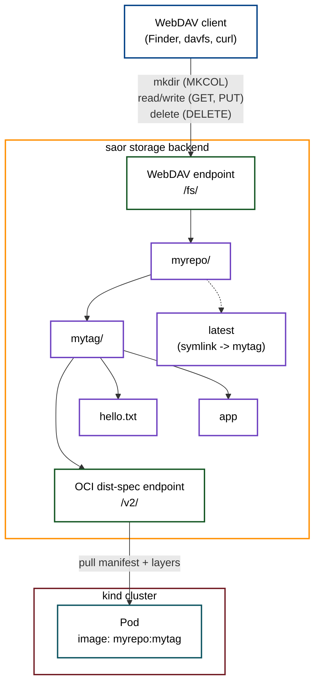

# saor

`saor` is a Go server that bridges the gap between traditional remote file systems and the Open Container Initiative (OCI) Distribution Specification.

It allows you to use a single highly-available storage backend (like ZFS, BTRFS, or a standard disk) and expose it in two distinct ways simultaneously:
1. **As a Remote Filesystem**: Mountable via standard WebDAV on Windows, macOS, and Linux.
2. **As an OCI Registry**: Accessible via the dist-spec `/v2/` API, allowing container ecosystem tools (like `oras`) to pull data directly.



A folder created over WebDAV (`myrepo/mytag/`) is what the dist-spec endpoint serves as an OCI image; a tag can also be a symlink to another tag's folder (`latest -> mytag`), the filesystem equivalent of a registry's moving `latest` tag. See [test/scripts/](test/scripts/) for a runnable demo of this end-to-end against a local [kind](https://kind.sigs.k8s.io/) cluster.

## How it works

`saor` is bi-directional:

**1. Filesystem -> OCI (Pull)**:
When a user creates a folder (e.g., `myrepo/mytag`) and places files in it via the WebDAV mount, `saor` dynamically compiles this folder into a **valid OCI Container Image**. 
When an OCI client requests the manifest, the server dynamically archives the folder into a `.tar.gz` layer, generates a valid OCI Image Configuration JSON, caches these blobs, and returns the manifest.

**2. OCI -> Filesystem (Push)**:
When a user pushes an image using an OCI tool (like `skopeo`), the server accepts the `.tar.gz` layer blobs into its cache. Once the manifest is uploaded, the server automatically un-tars and un-gzips the layers directly into the physical filesystem folder (`/repo/tag/`). The files are immediately visible and editable via the WebDAV mount!

## Building and Running

Ensure you have Go 1.22+ installed.

```sh
# Build the binary
go build -o saor .

# Run the server
./saor --root ./data --port 8080
```

## Usage

### 1. Write via WebDAV

The server exposes a WebDAV endpoint at `http://localhost:8080/fs/`.

You can mount this using your OS's native tools:
- **macOS**: Finder -> Go -> Connect to Server -> `http://localhost:8080/fs/`
- **Windows**: Map Network Drive -> `http://localhost:8080/fs/`
- **Linux**: `mount -t davfs http://localhost:8080/fs/ /mnt/registry`

Once mounted, create a directory structure like `myrepo/mytag` and copy a file `hello.txt` into it.

### 2. Read via OCI (ORAS, Skopeo)

Now that the file exists on the filesystem, you can pull the folder as a container image using standard OCI tools.

Using [Skopeo](https://github.com/containers/skopeo). Since the server runs over plain HTTP, pass `--src-tls-verify=false` so skopeo doesn't try HTTPS against it:
```sh
skopeo copy --src-tls-verify=false docker://localhost:8080/myrepo:mytag oci:./my_oci_image
```

Using [ORAS](https://oras.land/), pass `--plain-http` for the same reason. Since the folder is archived as a single `.tar.gz` layer rather than one blob per file, `oras pull` downloads it as `mytag.tar.gz` instead of extracting it:
```sh
oras pull --plain-http localhost:8080/myrepo:mytag
```

### 3. Push via OCI

Because `saor` is bi-directional, you can push images to it! Use `--dest-tls-verify=false` since the server is plain HTTP:

```sh
skopeo copy --dest-tls-verify=false oci:./my_oci_image docker://localhost:8080/myrepo:pushed_tag
```

Once pushed, the server automatically extracts the layers. You can immediately browse to `http://localhost:8080/fs/myrepo/pushed_tag` to view or edit the raw files!

> **Note:** `oras push` of individual files isn't supported for the extract-to-filesystem behavior — by default it uploads each file as its own uncompressed blob rather than a `.tar.gz` layer, which the server can't un-tar. Use `skopeo` (or another tool that produces `application/vnd.oci.image.layer.v1.tar+gzip` layers) to push.

## Documentation

For more detailed architectural documentation, please see the [docs/](docs/) folder.
